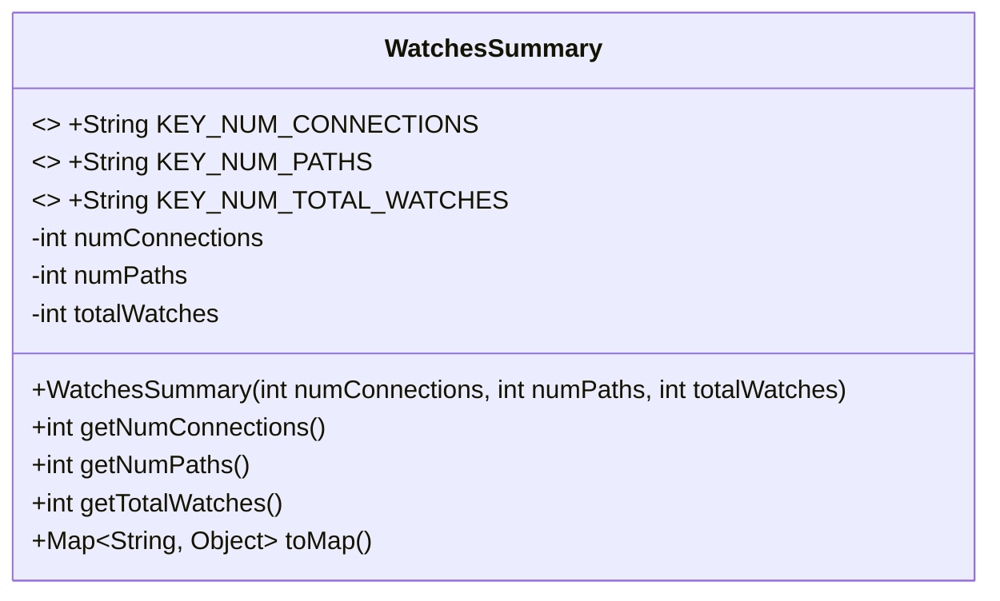
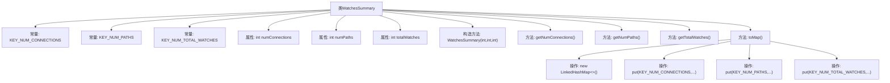

# 基础信息

|      |      |
|------|------|
| 名称 | WatchesSummary |
| 编码语言 | .java |
| 代码路径 | zookeeper/zookeeper-server/src/main/java/org/apache/zookeeper/server/watch/WatchesSummary.java |
| 包名 | org.apache.zookeeper.server.watch |
| 依赖项 | ['java.util.LinkedHashMap', 'java.util.Map'] |
| 概述说明 | WatchesSummary类记录连接数、路径数和总监视数，提供获取方法和转换为映射的功能。 |

# 说明

这是一个名为WatchesSummary的Java类，用于统计和存储监视相关的汇总数据。类中定义了三个常量作为映射键：KEY_NUM_CONNECTIONS表示连接数，KEY_NUM_PATHS表示路径数，KEY_NUM_TOTAL_WATCHES表示总监视数。类包含三个私有字段：numConnections记录设置监视的会话数量，numPaths记录被监视的路径数量，totalWatches记录总监视数量。构造函数接收这三个参数进行初始化。提供了三个getter方法分别获取这些值。toMap方法将汇总数据转换为可变的LinkedHashMap，使用预定义的键存储对应的值。

# 类列表 Class Summary

| 名称   | 类型  | 说明 |
|-------|------|-------------|
| WatchesSummary | class | WatchesSummary类用于统计监视信息，包含连接数、路径数和总监视数，提供获取方法和转换为Map的功能。 |

## 类 WatchesSummary

|      |      |
|------|------|
| 访问范围 | public |
| 类型 | class |
| 名称 | WatchesSummary |
| 说明 | WatchesSummary类用于统计监视信息，包含连接数、路径数和总监视数，提供获取方法和转换为Map的功能。 |

### UML类图

这段代码展示了一个名为WatchesSummary的类，用于统计和汇总监视器（watches）的相关数据。该类包含三个私有整型字段：numConnections（连接数）、numPaths（路径数）和totalWatches（总监视数），并通过公有方法提供对这些字段的访问。此外，类中还定义了三个公有静态常量作为映射键，以及一个toMap方法将统计信息转换为可变的LinkedHashMap。这个类主要用于收集和展示关于监视器连接的摘要信息，适用于需要监控和报告系统状态的场景。

### 内部方法调用关系图

这段代码定义了一个WatchesSummary类，用于统计和汇总监视器连接、路径和总数的相关信息。类中包含三个常量键名、三个私有属性记录统计值、构造方法初始化数据、三个getter方法获取统计值，以及一个toMap方法将统计结果转换为可变的LinkedHashMap。流程图清晰展示了类成员间的从属关系和方法调用链。

### 字段列表 Field List

| 名称  | 类型  | 说明 |
|-------|-------|------|
| KEY_NUM_PATHS = "num_paths" | String | 定义常量字符串KEY_NUM_PATHS，值为"num_paths"。 |
| totalWatches | int | 私有整型变量totalWatches，记录总数。 |
| numPaths | int | 私有整型变量numPaths，不可修改。 |
| numConnections | int | 私有整型变量numConnections，用于记录连接数。 |
| KEY_NUM_TOTAL_WATCHES = "num_total_watches" | String | 定义静态常量字符串KEY_NUM_TOTAL_WATCHES，值为"num_total_watches"。 |
| KEY_NUM_CONNECTIONS = "num_connections" | String | 定义常量字符串KEY_NUM_CONNECTIONS，值为"num_connections"。 |

### 方法列表 Method List

| 名称  | 类型  | 说明 |
|-------|-------|------|
| getNumConnections | int | 方法返回当前连接数。 |
| getTotalWatches | int | 方法返回总手表数量。 |
| getNumPaths | int | 获取路径数量的方法，返回整型变量numPaths的值。 |
| toMap | Map<String, Object> | 将对象属性转换为Map，包含连接数、路径数和总监视数。 |

