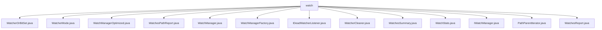

# 基础信息

|      |      |
|------|------|
| 名称 | watch |
| 编码语言 | .java |
| 代码路径 | zookeeper/zookeeper-server/src/main/java/org/apache/zookeeper/server/watch |
| 包名 | zookeeper.docs.zookeeper-server.src.main.java.org.apache.zookeeper.server.watch |
| 概述说明 | WatcherOrBitSet类封装Watcher集合或位集合操作。WatcherMode枚举定义三种监视模式。WatchManagerOptimized高效管理监视器，线程安全。WatchesPathReport管理路径与会话映射。WatchManager实现监视器管理接口。WatchManagerFactory创建监视管理器实例。IDeadWatcherListener处理死监视器。WatcherCleaner异步清理死监视器。WatchesSummary统计监视数据。WatchStats管理监听状态。IWatchManager定义核心监视功能。PathParentIterator遍历路径及父路径。WatchesReport管理会话与路径映射。 |

# 说明

## 概述  
1. 该模块是ZooKeeper的监视器管理系统，负责高效管理节点路径与客户端Watcher的映射关系，类似文件系统的变更通知机制。  
2. 主要接口包括IWatchManager的增删查改方法，例如通过triggerWatch触发事件通知，支持STANDARD/PERSISTENT等模式。  
3. 关键数据结构包括ConcurrentHashMap路径映射表、BitHashSet位集合，例如WatchManagerOptimized使用位图优化存储。  
4. 依赖Java并发库（如读写锁）和反射机制，例如WatchManagerFactory通过反射加载自定义实现类。  
5. 实现包含线程安全设计，例如WatcherCleaner异步清理死监视器，减少主线程阻塞。  

## 主要业务场景  
1. 处理客户端对ZNode的监听请求，例如addWatch添加路径监视，触发事件时回调Watcher。  
2. 采用异步事件驱动模式，例如通过IDeadWatcherListener处理断开会话的监视器清理。  
3. 功能覆盖全生命周期管理，例如支持递归监听、统计报告导出（WatchesSummary生成连接数/路径数等指标）。  
4. 典型应用于分布式协调场景，例如IDE插件通过RPC集成获取节点变更通知。  
5. 提供工厂模式扩展点，例如通过系统属性ZOOKEEPER_WATCH_MANAGER_NAME切换实现类。  
6. 与ZooDef协议深度集成，例如WatcherMode枚举类实现ZooDef整数到监听模式的转换。

### 包内部结构视图

该流程图展示了Zookeeper服务器中watch目录下的文件层级关系。所有Java文件均直接隶属于watch节点，包含WatcherOrBitSet、WatcherMode等13个具体实现类，涉及监控管理、路径迭代、状态统计等功能模块。结构呈现扁平化特征，无次级目录嵌套，体现了监控功能组件的集中管理方式。

# 文件列表 File List

| 名称   | 类型  | 说明 |
|-------|------|-------------|
| [WatcherOrBitSet.java](WatcherOrBitSet.md) | file | 类WatcherOrBitSet管理Watcher集合或BitHashSet，提供contains和size方法检查元素存在及集合大小。 |
| [WatcherCleaner.java](WatcherCleaner.md) | file | WatcherCleaner线程类，用于清理ZooKeeper中的死观察者。包含阈值控制、批量处理、多线程清理及性能监控功能。通过监听器处理死观察者，支持动态配置和优雅关闭。 |
| [IDeadWatcherListener.java](IDeadWatcherListener.md) | file | 接口IDeadWatcherListener定义方法processDeadWatchers，用于处理已关闭连接的监视器集合。参数为deadWatchers，类型为Set<Integer>。 |
| [WatchManagerFactory.java](WatchManagerFactory.md) | file | WatchManagerFactory类提供静态方法createWatchManager，通过系统属性或默认类名创建IWatchManager实例，失败时抛出IOException。 |
| [WatchManager.java](WatchManager.md) | file | WatchManager类管理监视器，提供添加、移除、触发监视器功能，支持递归和持久模式，维护路径与监视器映射关系，统计监视器数量。 |
| [WatchesPathReport.java](WatchesPathReport.md) | file | WatchesPathReport类跟踪路径与监听会话ID的映射，提供查询路径监听状态、获取会话ID及导出映射的方法，确保数据不可变性和线程安全。 |
| [WatchManagerOptimized.java](WatchManagerOptimized.md) | file | WatchManagerOptimized类实现高效监视器管理，使用并发哈希表存储路径监视器，位图映射监视器ID，读写锁控制并发，支持添加、移除、触发监视器及清理失效监视器，提供统计和报告功能。 |
| [PathParentIterator.java](PathParentIterator.md) | file | PathParentIterator迭代路径及其父路径，支持全路径或单路径迭代，提供hasNext、next等方法，不可修改路径。 |
| [WatchStats.java](WatchStats.md) | file | WatchStats类管理节点监听模式，通过标志位存储组合状态，提供添加、移除和检查监听模式的方法。 |
| [WatchesReport.java](WatchesReport.md) | file | WatchesReport类用于管理会话ID与监听路径的映射，提供不可修改的路径查询和深拷贝功能，支持检查会话是否有监听路径及转换为可变映射。 |
| [IWatchManager.java](IWatchManager.md) | file | IWatchManager接口提供管理ZooKeeper节点监视器的功能，包括添加、检查、移除监视器，触发事件通知，获取监视器统计信息及清理资源。支持默认和自定义监视模式。 |
| [WatchesSummary.java](WatchesSummary.md) | file | WatchesSummary类记录连接数、路径数和总监视数，提供获取方法和转换为映射的功能。 |
| [WatcherMode.java](WatcherMode.md) | file | WatcherMode枚举定义了三种监听模式：标准、持久、持久递归，包含属性和转换方法。默认模式为标准。 |

