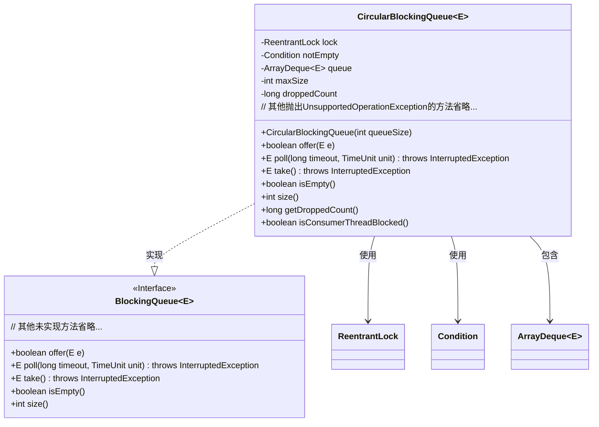
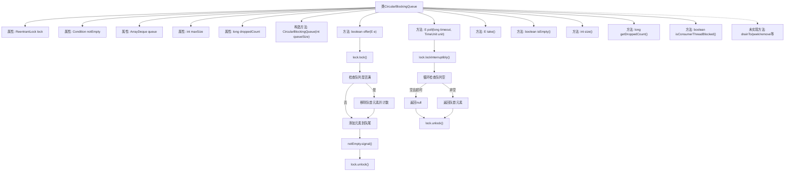

# 基础信息

|      |      |
|------|------|
| 名称 | CircularBlockingQueue |
| 编码语言 | .java |
| 代码路径 | zookeeper/zookeeper-server/src/main/java/org/apache/zookeeper/util/CircularBlockingQueue.java |
| 包名 | org.apache.zookeeper.util |
| 依赖项 | ['java.util.ArrayDeque', 'java.util.Collection', 'java.util.Iterator', 'java.util.Objects', 'java.util.concurrent.BlockingQueue', 'java.util.concurrent.TimeUnit', 'java.util.concurrent.locks.Condition', 'java.util.concurrent.locks.ReentrantLock', 'org.slf4j.Logger', 'org.slf4j.LoggerFactory'] |
| 概述说明 | 循环阻塞队列实现，基于数组双端队列，线程安全，满时自动丢弃最旧元素，支持阻塞获取和超时操作，统计丢弃元素数量。 |

# 说明

CircularBlockingQueue是一个线程安全的循环阻塞队列实现，基于ArrayDeque存储元素，使用ReentrantLock保证并发安全。当队列满时，offer方法会自动移除最旧元素以容纳新元素，并记录丢弃计数。提供take和poll(long,TimeUnit)方法进行阻塞式消费，支持空队列等待。未实现部分方法直接抛出UnsupportedOperationException。包含统计丢弃元素数量、检测消费者线程阻塞状态等辅助功能。

# 类列表 Class Summary

| 名称   | 类型  | 说明 |
|-------|------|-------------|
| CircularBlockingQueue | class | 循环阻塞队列实现，基于数组和重入锁，支持线程安全操作，满时丢弃最旧元素，提供等待和超时获取功能。 |

## 类 CircularBlockingQueue

|      |      |
|------|------|
| 访问范围 | public |
| 类型 | class |
| 名称 | CircularBlockingQueue |
| 说明 | 循环阻塞队列实现，基于数组和重入锁，支持线程安全操作，满时丢弃最旧元素，提供等待和超时获取功能。 |

### UML类图

该类图展示了CircularBlockingQueue的实现结构，它是一个泛型循环阻塞队列，实现了BlockingQueue接口。核心功能通过ReentrantLock实现线程安全，使用Condition处理空队列等待，内部采用ArrayDeque存储元素。当队列满时，offer方法会移除最旧元素并记录丢弃计数。该类提供了基本的阻塞/非阻塞操作方法（take/poll），但未实现部分集合操作接口方法。其设计特点是容量固定、线程安全且支持生产者-消费者模式，适合高并发场景下的任务队列管理。

### 内部方法调用关系图

该流程图展示了CircularBlockingQueue的核心结构和主要方法调用关系。这是一个线程安全的循环阻塞队列实现，当队列满时会自动丢弃最老的元素。核心逻辑集中在offer/poll/take等方法，通过ReentrantLock和Condition实现线程同步。图中清晰呈现了锁获取、队列状态检查、元素操作和条件通知等关键步骤，同时标注了多个未实现的BlockingQueue接口方法。

### 字段列表 Field List

| 名称  | 类型  | 说明 |
|-------|-------|------|
| lock | ReentrantLock | 私有可重入锁对象。 |
| droppedCount | long | 私有长整型变量droppedCount，用于记录丢弃数量。 |
| notEmpty | Condition | 私有不可变条件变量notEmpty |
| LOG = LoggerFactory.getLogger(CircularBlockingQueue.class) | Logger | 类CircularBlockingQueue的私有静态日志记录器实例LOG，通过LoggerFactory获取。 |
| maxSize | int | 私有整型常量maxSize，用于存储最大尺寸值。 |
| queue | ArrayDeque<E> | 私有队列，存储类型为E的元素。 |

### 方法列表 Method List

| 名称  | 类型  | 说明 |
|-------|-------|------|
| drainTo | int | Java方法drainTo被重写，抛出UnsupportedOperationException异常，不支持转移元素到指定集合。 |
| offer | boolean | 该方法重写offer操作，但抛出UnsupportedOperationException异常，表示不支持带超时的元素插入。 |
| containsAll | boolean | 重写containsAll方法，直接抛出UnsupportedOperationException异常。 |
| poll | E | 重写poll方法，抛出UnsupportedOperationException异常。 |
| poll | E | 重写poll方法，支持超时等待获取队列元素。获取锁后检查队列是否为空，若空则等待指定时间，超时返回null，否则返回队列头部元素并释放锁。 |
| isConsumerThreadBlocked | boolean | 检查消费者线程是否阻塞：获取锁后判断等待队列长度是否大于0，最后释放锁。 |
| clear | void | 重写clear方法，抛出UnsupportedOperationException异常，表示不支持该操作。 |
| toArray | Object[] | 重写toArray方法，抛出不支持操作异常。 |
| toArray | T[] | Java方法重写，抛出UnsupportedOperationException异常，不支持数组转换操作。 |
| addAll | boolean | 重写addAll方法，抛出UnsupportedOperationException异常，表示不支持该操作。 |
| offer | boolean | Java方法offer(E e)使用锁确保线程安全，当队列满时移除最旧元素并计数，添加新元素后发送非空信号，最后释放锁并返回true。 |
| size | int | 重写size方法，加锁获取队列大小后释放锁。 |
| take | E | Java方法`take()`使用可中断锁获取队列元素，队列空时等待，最终释放锁。 |
| retainAll | boolean | Java方法重写，抛出UnsupportedOperationException异常，表示不支持retainAll操作。 |
| drainTo | int | Java方法drainTo被重写，直接抛出UnsupportedOperationException异常，不支持将元素转移到指定集合。 |
| peek | E | 重写peek方法，直接抛出UnsupportedOperationException异常。 |
| isEmpty | boolean | 重写isEmpty方法，使用锁确保线程安全，检查队列是否为空并在操作后释放锁。 |
| getDroppedCount | long | 获取丢弃计数值的方法，返回长整型变量droppedCount。 |
| remove | E | 重写remove方法，直接抛出UnsupportedOperationException异常，表示不支持该操作。 |
| iterator | Iterator<E> | 重写iterator方法，直接抛出UnsupportedOperationException异常。 |
| removeAll | boolean | Java方法重写，抛出UnsupportedOperationException异常，不支持removeAll操作。 |
| add | boolean | 重写add方法，直接抛出UnsupportedOperationException异常。 |
| element | E | 重写element方法，抛出UnsupportedOperationException异常。 |
| contains | boolean | 重写contains方法，直接抛出UnsupportedOperationException异常。 |
| put | void | 重写put方法抛出UnsupportedOperationException异常。 |
| remainingCapacity | int | 重写remainingCapacity方法，抛出未支持操作异常。 |
| remove | boolean | 重写remove方法，抛出UnsupportedOperationException异常，表示不支持此操作。 |

