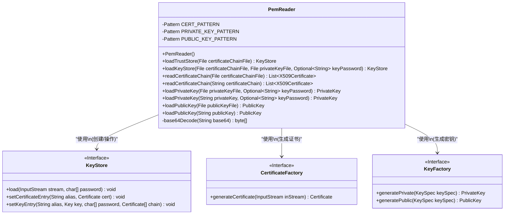
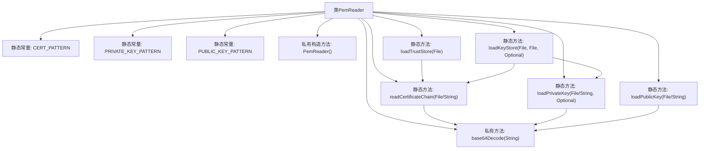

# 基础信息

|      |      |
|------|------|
| 名称 | PemReader |
| 编码语言 | .java |
| 代码路径 | zookeeper/zookeeper-server/src/main/java/org/apache/zookeeper/util/PemReader.java |
| 包名 | org.apache.zookeeper.util |
| 依赖项 | ['java.nio.charset.StandardCharsets.US_ASCII', 'java.util.Base64.getMimeDecoder', 'java.util.regex.Pattern.CASE_INSENSITIVE', 'javax.crypto.Cipher.DECRYPT_MODE', 'java.io.ByteArrayInputStream', 'java.io.File', 'java.io.IOException', 'java.nio.file.Files', 'java.security.GeneralSecurityException', 'java.security.KeyFactory', 'java.security.KeyStore', 'java.security.KeyStoreException', 'java.security.PrivateKey', 'java.security.PublicKey', 'java.security.cert.Certificate', 'java.security.cert.CertificateException', 'java.security.cert.CertificateFactory', 'java.security.cert.X509Certificate', 'java.security.spec.InvalidKeySpecException', 'java.security.spec.PKCS8EncodedKeySpec', 'java.security.spec.X509EncodedKeySpec', 'java.util.ArrayList', 'java.util.List', 'java.util.Optional', 'java.util.regex.Matcher', 'java.util.regex.Pattern', 'javax.crypto.Cipher', 'javax.crypto.EncryptedPrivateKeyInfo', 'javax.crypto.SecretKey', 'javax.crypto.SecretKeyFactory', 'javax.crypto.spec.PBEKeySpec', 'javax.security.auth.x500.X500Principal'] |
| 概述说明 | PemReader类提供读取PEM格式证书和密钥的功能，支持加载信任库和密钥库，解析X509证书链、RSA/EC/DSA私钥及公钥，包含Base64解码和密码解密处理。 |

# 说明

PemReader类是一个用于处理PEM格式证书和密钥的工具类。它包含三个正则表达式模式，分别用于匹配证书、私钥和公钥的PEM格式。类提供了加载信任存储和密钥存储的方法，支持从文件读取证书链和私钥。私钥加载支持密码保护解密，并尝试RSA、EC和DSA三种密钥类型。公钥加载同样支持这三种类型。所有方法都处理Base64解码和PEM格式解析，适用于常见加密场景。

# 类列表 Class Summary

| 名称   | 类型  | 说明 |
|-------|------|-------------|
| PemReader | class | PemReader类提供读取PEM格式证书和密钥的方法，包括加载信任库、密钥库、证书链、私钥和公钥，支持RSA、EC和DSA算法。 |

## 类 PemReader

|      |      |
|------|------|
| 访问范围 | public final |
| 类型 | class |
| 名称 | PemReader |
| 说明 | PemReader类提供读取PEM格式证书和密钥的方法，包括加载信任库、密钥库、证书链、私钥和公钥，支持RSA、EC和DSA算法。 |

### UML类图

类图描述：
PemReader是一个用于处理PEM格式密钥和证书的工具类，包含三个核心正则表达式模式用于匹配证书、私钥和公钥。它提供静态方法加载信任库(loadTrustStore)、密钥库(loadKeyStore)，以及读取证书链(readCertificateChain)、加载私钥(loadPrivateKey)和公钥(loadPublicKey)。该类依赖于Java安全体系的KeyStore、CertificateFactory和KeyFactory接口，通过模式匹配和Base64解码实现PEM文件到Java密钥对象的转换，支持RSA/EC/DSA三种算法。所有方法均为静态，体现了工具类的设计特点。

### 内部方法调用关系图

这段代码定义了一个PemReader工具类，主要用于处理PEM格式的证书和密钥文件。类中包含三个正则表达式模式用于匹配证书、私钥和公钥，以及多个静态方法用于加载和解析这些文件。核心功能包括：加载信任存储(loadTrustStore)、加载密钥存储(loadKeyStore)、读取证书链(readCertificateChain)、加载私钥(loadPrivateKey)和加载公钥(loadPublicKey)。所有方法最终都会调用base64Decode方法进行Base64解码。该类采用工厂模式设计，通过静态方法提供功能，构造方法被私有化以防止实例化。

### 字段列表 Field List

| 名称  | 类型  | 说明 |
|-------|-------|------|
| CERT_PATTERN = Pattern.compile(        "-+BEGIN\\s+.*CERTIFICATE[^-]*-+(?:\\s|\\r|\\n)+" // Header        + "([a-z0-9+/=\\r\\n]+)"                     // Base64 text        + "-+END\\s+.*CERTIFICATE[^-]*-+",           // Footer        CASE_INSENSITIVE) | Pattern | 定义正则表达式匹配证书格式，包含头部、Base64内容和尾部，忽略大小写。 |
| PUBLIC_KEY_PATTERN = Pattern.compile(        "-+BEGIN\\s+.*PUBLIC\\s+KEY[^-]*-+(?:\\s|\\r|\\n)+" // Header        + "([a-z0-9+/=\\r\\n]+)"                      // Base64 text        + "-+END\\s+.*PUBLIC\\s+KEY[^-]*-+",            // Footer        CASE_INSENSITIVE) | Pattern | 定义正则表达式匹配公钥格式，包含头部、Base64内容和尾部，忽略大小写。 |
| PRIVATE_KEY_PATTERN = Pattern.compile(        "-+BEGIN\\s+.*PRIVATE\\s+KEY[^-]*-+(?:\\s|\\r|\\n)+" // Header        + "([a-z0-9+/=\\r\\n]+)"                       // Base64 text        + "-+END\\s+.*PRIVATE\\s+KEY[^-]*-+",            // Footer        CASE_INSENSITIVE) | Pattern | 定义正则表达式匹配私钥格式，包含头尾标记和Base64内容，忽略大小写。 |

### 方法列表 Method List

| 名称  | 类型  | 说明 |
|-------|-------|------|
| loadPublicKey | PublicKey | 从文件加载公钥，读取ASCII内容并调用内部方法处理，可能抛出IO或安全异常。 |
| loadPublicKey | PublicKey | 该方法加载公钥，先匹配并解码Base64数据，尝试用RSA、EC、DSA算法生成公钥对象，失败则抛出异常。 |
| base64Decode | byte[] | 私有静态方法，将Base64字符串解码为字节数组，使用US_ASCII字符集和MIME解码器。 |
| loadPrivateKey | PrivateKey | 静态方法loadPrivateKey从文件读取私钥，支持密码解密，可能抛出IO或安全异常。 |
| loadKeyStore | KeyStore | 静态方法loadKeyStore加载密钥库：读取私钥和证书链，验证非空后创建JKS密钥库并存入密钥条目，返回密钥库对象。 |
| loadTrustStore | KeyStore | 加载证书链到JKS信任库，返回KeyStore实例。处理X509证书，使用RFC2253格式主题名作为条目别名。 |
| loadPrivateKey | PrivateKey | 加载私钥方法：检查格式，解码Base64，支持密码解密PKCS8格式，尝试RSA/EC/DSA算法生成私钥。 |
| readCertificateChain | List<X509Certificate> | 读取证书链文件并返回X509证书列表，处理IO和安全异常。 |
| readCertificateChain | List<X509Certificate> | 该方法从字符串读取X.509证书链，使用正则匹配提取Base64编码的证书数据，解码后生成证书对象并返回列表。 |

