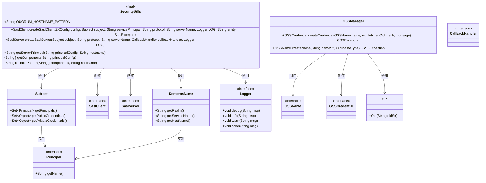
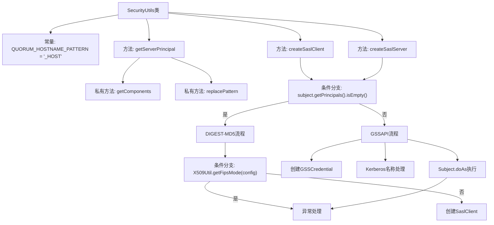
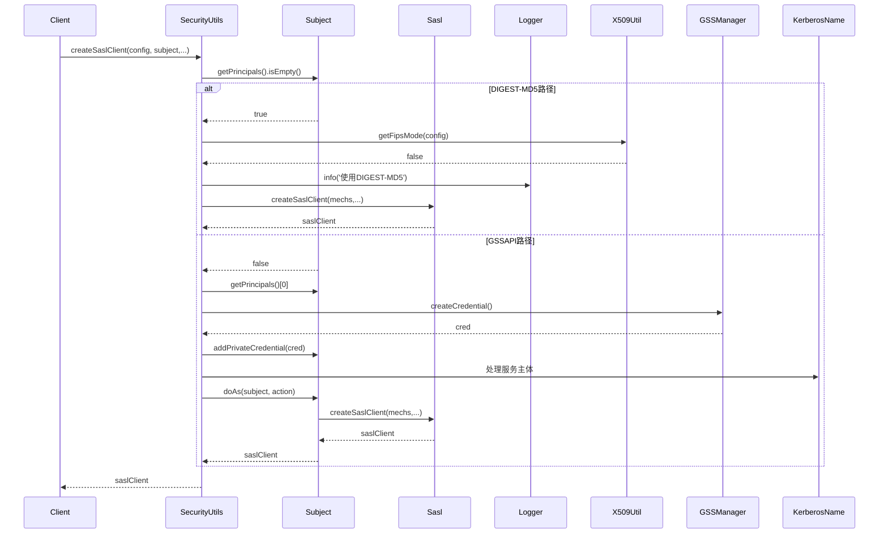

# 基础信息

|      |      |
|------|------|
| 名称 | SecurityUtils |
| 编码语言 | .java |
| 代码路径 | zookeeper/zookeeper-server/src/main/java/org/apache/zookeeper/util/SecurityUtils.java |
| 包名 | org.apache.zookeeper.util |
| 依赖项 | ['java.security.Principal', 'java.security.PrivilegedActionException', 'java.security.PrivilegedExceptionAction', 'javax.security.auth.Subject', 'javax.security.auth.callback.CallbackHandler', 'javax.security.sasl.Sasl', 'javax.security.sasl.SaslClient', 'javax.security.sasl.SaslException', 'javax.security.sasl.SaslServer', 'org.apache.zookeeper.SaslClientCallbackHandler', 'org.apache.zookeeper.common.X509Util', 'org.apache.zookeeper.common.ZKConfig', 'org.apache.zookeeper.server.auth.KerberosName', 'org.ietf.jgss.GSSContext', 'org.ietf.jgss.GSSCredential', 'org.ietf.jgss.GSSException', 'org.ietf.jgss.GSSManager', 'org.ietf.jgss.GSSName', 'org.ietf.jgss.Oid', 'org.slf4j.Logger'] |
| 概述说明 | SecurityUtils类提供SASL客户端和服务端创建功能，支持DIGEST-MD5和GSSAPI机制，处理Kerberos主体名转换，包含FIPS模式检查和日志记录。 |

# 说明

SecurityUtils类提供了SASL客户端和服务器的创建功能，支持GSSAPI和DIGEST-MD5两种认证机制。对于客户端，根据Subject的Principals是否为空选择机制：空则使用DIGEST-MD5，否则使用GSSAPI。GSSAPI模式下处理Kerberos凭证和领域信息，DIGEST-MD5模式下处理用户名和密码。服务器端同样支持两种机制，根据Subject的存在与否选择，处理服务主体名称和主机名。类还包含将包含_HOST模式的Kerberos主体名转换为实际主机名的工具方法。整个过程涉及日志记录、异常处理和FIPS模式检查。

# 类列表 Class Summary

| 名称   | 类型  | 说明 |
|-------|------|-------------|
| SecurityUtils | class | SecurityUtils类提供SASL客户端和服务端创建功能，支持DIGEST-MD5和GSSAPI机制，处理Kerberos主体名转换，并包含FIPS模式检查。 |

## 类 SecurityUtils

|      |      |
|------|------|
| 访问范围 | public final |
| 类型 | class |
| 名称 | SecurityUtils |
| 说明 | SecurityUtils类提供SASL客户端和服务端创建功能，支持DIGEST-MD5和GSSAPI机制，处理Kerberos主体名转换，并包含FIPS模式检查。 |

### UML类图

类图描述：SecurityUtils是一个工具类，提供创建SASL客户端和服务器的静态方法，支持GSSAPI和DIGEST-MD5两种认证机制。它依赖于Subject、Principal、KerberosName等类来处理Kerberos认证，使用Logger记录日志，并通过GSSManager管理GSSAPI凭证。类图展示了SecurityUtils与这些关键类之间的依赖关系，以及各个接口的实现层级。

### 内部方法调用关系图

该流程图展示了SecurityUtils类的核心方法调用关系，重点描述了createSaslClient方法的两条主要执行路径：当subject无principal时采用DIGEST-MD5认证机制，否则使用GSSAPI/Kerberos认证。时序图则详细呈现了客户端调用createSaslClient时的完整交互过程，包括条件分支处理、凭证创建、Kerberos名称解析等关键步骤，以及异常处理流程。两个图表共同揭示了该安全工具类处理SASL认证的完整逻辑架构。

### 字段列表 Field List

| 名称  | 类型  | 说明 |
|-------|-------|------|
| QUORUM_HOSTNAME_PATTERN = "_HOST" | String | 静态常量QUORUM_HOSTNAME_PATTERN定义为"_HOST"，用于主机名模式匹配。 |

### 方法列表 Method List

| 名称  | 类型  | 说明 |
|-------|-------|------|
| getServerPrincipal | String | 静态方法getServerPrincipal根据配置和主机名生成服务器主体名。若配置无效或不含主机名模式，直接返回原配置；否则用主机名替换模式并返回结果。 |
| getComponents | String[] | 该方法检查输入字符串是否为空，若为空返回null，否则按斜杠分割字符串并返回数组。 |
| createSaslClient | SaslClient | 创建SASL客户端方法：根据主体是否为空选择DIGEST-MD5或GSSAPI机制。FIPS模式禁用DIGEST-MD5。GSSAPI需处理Kerberos凭证和域名。 |
| createSaslServer | SaslServer | 创建SASL服务器，支持GSSAPI和DIGEST-MD5机制。若使用JAAS认证主体，解析服务主体名和主机名，添加私有凭证；否则默认DIGEST-MD5。异常时记录错误并返回null。 |
| replacePattern | String | 私有静态方法，将字符串数组首元素与小写主机名拼接，格式为"首元素/主机名"。 |

