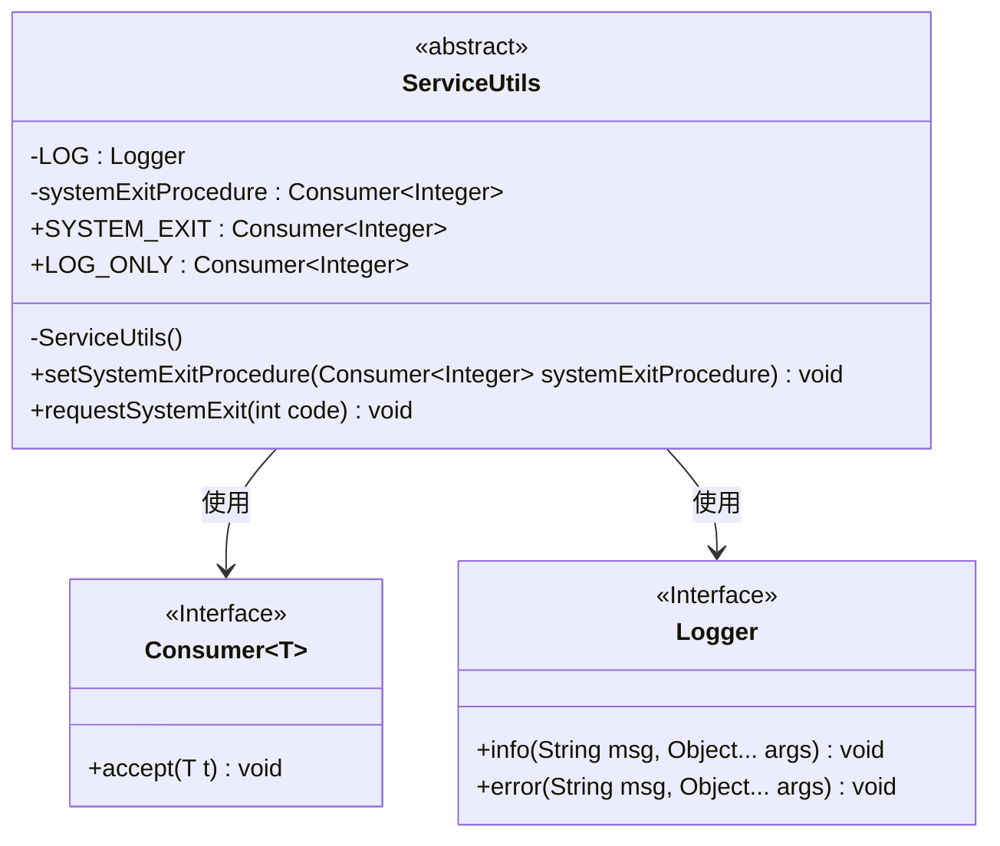
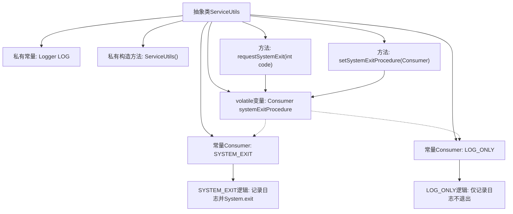

# 基础信息

|      |      |
|------|------|
| 名称 | ServiceUtils |
| 编码语言 | .java |
| 代码路径 | zookeeper/zookeeper-server/src/main/java/org/apache/zookeeper/util/ServiceUtils.java |
| 包名 | org.apache.zookeeper.util |
| 依赖项 | ['edu.umd.cs.findbugs.annotations.SuppressFBWarnings', 'java.util.Objects', 'java.util.function.Consumer', 'org.apache.zookeeper.server.ExitCode', 'org.slf4j.Logger', 'org.slf4j.LoggerFactory'] |
| 概述说明 | ServiceUtils类提供JVM退出控制，含SYSTEM_EXIT和LOG_ONLY两种策略，支持自定义退出行为。 |

# 说明

该抽象类ServiceUtils提供了JVM关闭的默认策略和自定义功能。包含两个主要消费者：SYSTEM_EXIT会记录日志并调用System.exit终止JVM；LOG_ONLY仅记录日志不实际退出，适用于测试场景。通过volatile变量systemExitProcedure存储当前策略，可用setSystemExitProcedure方法动态修改。requestSystemExit方法触发当前策略执行。类设计为工具类，构造器私有化防止实例化。

# 类列表 Class Summary

| 名称   | 类型  | 说明 |
|-------|------|-------------|
| ServiceUtils | class | ServiceUtils类提供JVM退出控制，含SYSTEM_EXIT（实际退出）和LOG_ONLY（仅记录）两种策略，支持动态设置退出处理程序。 |

## 类 ServiceUtils

|      |      |
|------|------|
| 访问范围 | public abstract |
| 类型 | class |
| 名称 | ServiceUtils |
| 说明 | ServiceUtils类提供JVM退出控制，含SYSTEM_EXIT（实际退出）和LOG_ONLY（仅记录）两种策略，支持动态设置退出处理程序。 |

### UML类图

这段代码展示了一个抽象工具类ServiceUtils，主要用于控制JVM的退出行为。它包含两个预定义的Consumer实现（SYSTEM_EXIT和LOG_ONLY），分别用于实际退出JVM和仅记录日志的场景。通过setSystemExitProcedure方法可以动态切换退出策略，requestSystemExit方法则触发当前设置的退出流程。该类使用了Logger进行日志记录，并通过泛型Consumer接口实现策略模式，提供了灵活的JVM退出控制机制。

### 内部方法调用关系图

这段代码流程图展示了ServiceUtils工具类的核心结构。该类提供了两种JVM退出策略：SYSTEM_EXIT会实际调用System.exit()并记录日志，而LOG_ONLY仅模拟退出行为用于测试。通过volatile变量systemExitProcedure动态切换策略，setSystemExitProcedure方法允许运行时修改退出行为，requestSystemExit则是统一的退出入口。整个设计实现了优雅的退出策略模式，特别适合需要控制JVM退出行为的测试场景。

### 字段列表 Field List

| 名称  | 类型  | 说明 |
|-------|-------|------|
| SYSTEM_EXIT = (code) -> {        String msg = "Exiting JVM with code {}";        if (code == 0) {            // JVM exits normally            LOG.info(msg, code);        } else {            // JVM exits with error            LOG.error(msg, code);        }        System.exit(code);    } | Consumer<Integer> | 定义了一个静态常量SYSTEM_EXIT，作为Consumer<Integer>，根据传入的退出码记录日志并调用System.exit()。0为正常退出记录info，非0为错误记录error。 |
| LOG_ONLY = (code) -> {        if (code != 0) {            LOG.error("Fatal error, JVM should exit with code {}. "                + "Actually System.exit is disabled", code);        } else {            LOG.info("JVM should exit with code {}. Actually System.exit is disabled", code);        }    } | Consumer<Integer> | 定义静态终态Consumer对象LOG_ONLY，根据输入code值记录不同级别日志：非0时输出错误日志，0时输出信息日志，均提示System.exit被禁用。 |
| systemExitProcedure = SYSTEM_EXIT | Consumer<Integer> | 私有静态可变变量systemExitProcedure，类型为Consumer<Integer>，初始值为SYSTEM_EXIT。 |
| LOG = LoggerFactory.getLogger(ServiceUtils.class) | Logger | 声明ServiceUtils类的私有静态日志常量LOG，使用LoggerFactory获取Logger实例。 |

### 方法列表 Method List

| 名称  | 类型  | 说明 |
|-------|-------|------|
| setSystemExitProcedure | void | 设置系统退出处理程序，接受非空Consumer参数并赋值给静态变量。 |
| requestSystemExit | void | 静态方法requestSystemExit接收整型参数code，调用systemExitProcedure执行系统退出操作。 |

