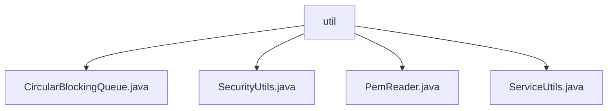

# 基础信息

|      |      |
|------|------|
| 名称 | util |
| 编码语言 | .java |
| 代码路径 | zookeeper/zookeeper-server/src/main/java/org/apache/zookeeper/util |
| 包名 | zookeeper.docs.zookeeper-server.src.main.java.org.apache.zookeeper.util |
| 概述说明 | CircularBlockingQueue是线程安全循环队列，满时自动移除旧元素。SecurityUtils支持SASL客户端和服务器的GSSAPI和DIGEST-MD5认证。PemReader处理PEM格式证书和密钥，支持多种密钥类型。ServiceUtils提供JVM关闭策略，支持系统退出或仅记录日志。 |

# 说明

## 概述  
该模块提供ZooKeeper服务端的核心工具组件，包括线程安全队列、安全认证、证书处理和JVM生命周期管理。主要接口规范涵盖阻塞队列操作（如take/poll）、SASL认证协议（GSSAPI/DIGEST-MD5）和PEM证书解析API。关键数据结构包括基于ArrayDeque的循环队列和Kerberos主体名映射表。外部依赖涉及Java加密体系（如RSA/EC密钥）和SASL认证库。例如SecurityUtils通过Subject自动选择认证机制，类似门禁系统的多因子验证。

## 主要业务场景  
支持ZooKeeper客户端连接认证、服务端证书加载和线程安全任务调度等流程。典型交互模式如队列满时自动淘汰旧元素，类似滑动窗口流量控制。功能完整性体现在支持主流加密算法（RSA/EC/DSA）和两种SASL机制，但部分队列方法明确不实现。主要使用场景包括Kerberos环境下的安全通信和PEM证书管理。提供静态工具类API，例如PemReader采用建造者模式解析密钥文件。第三方集成案例可参考与SASL兼容系统的认证对接。

### 包内部结构视图

该流程图展示了Zookeeper项目中util目录下的文件结构关系。根节点为util文件夹，包含四个Java工具类文件：CircularBlockingQueue实现环形阻塞队列功能，SecurityUtils处理安全相关操作，PemReader用于PEM格式文件读取，ServiceUtils提供通用服务工具方法。所有文件均位于相同层级，没有嵌套子目录。

# 文件列表 File List

| 名称   | 类型  | 说明 |
|-------|------|-------------|
| [SecurityUtils.java](SecurityUtils.md) | file | SecurityUtils类提供SASL客户端和服务端创建功能，支持DIGEST-MD5和GSSAPI机制，处理Kerberos主体名转换，包含FIPS模式检查和日志记录。 |
| [CircularBlockingQueue.java](CircularBlockingQueue.md) | file | 循环阻塞队列实现，基于数组双端队列，线程安全，满时自动丢弃最旧元素，支持阻塞获取和超时操作，统计丢弃元素数量。 |
| [ServiceUtils.java](ServiceUtils.md) | file | ServiceUtils类提供JVM退出控制，含SYSTEM_EXIT和LOG_ONLY两种策略，支持自定义退出行为。 |
| [PemReader.java](PemReader.md) | file | PemReader类提供读取PEM格式证书和密钥的功能，支持加载信任库和密钥库，解析X509证书链、RSA/EC/DSA私钥及公钥，包含Base64解码和密码解密处理。 |

