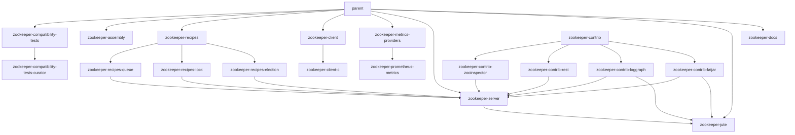

[回到首页](../README.md)

## 项目概览
### 项目基本信息
- **名称:** Apache ZooKeeper
- **GroupId (Maven):** org.apache.zookeeper
- **ArtifactId (Maven):** parent
- **Version:** 3.10.0-SNAPSHOT
- **主要编程语言:** Java

## 先决条件
- **JDK 版本:** 1.8 (从 Maven 的 `<maven.compiler.source>` 和 `<maven.compiler.target>` 属性推断)
- **构建工具版本:** Maven (从所有文件的 `<modelVersion>4.0.0</modelVersion>` 推断)
- **网络连接中间件依赖:**
  - Netty: 4.1.119.Final
  - Jetty: 9.4.57.v20241219
  - Apache Kerby: 2.0.0 (用于 Kerberos 集成)
  - Bouncy Castle: 1.78 (用于加密功能)
  - Prometheus Client: 0.9.0 (用于监控)

## 构建指南
### Maven 构建
- 构建命令:
    - 清理构建: `mvn clean`
    - 编译项目: `mvn compile`
    - 打包项目: `mvn package`
    - 安装到本地仓库: `mvn install`
    - 部署项目: `mvn deploy`
- 构建流程: 
    - Maven 会按照生命周期顺序执行构建，包括清理、编译、测试、打包、安装等阶段。
    - 项目是多模块的，构建时会根据模块依赖关系按顺序构建。
    - 可以使用 `mvn -pl <module> -am` 构建指定模块及其依赖。
- 打包目录: 
    - 打包后的文件通常位于各模块的 `target/` 目录下。
    - 主模块会生成 `apache-zookeeper-<version>-bin.tar.gz` 和 `apache-zookeeper-<version>-lib.tar.gz` 文件。
    - 其他模块会生成对应的 JAR 文件。

### 特殊构建选项
- 完整构建（包含所有模块）: `mvn install -Pfull-build`
- 跳过测试: `mvn install -DskipTests`
- 生成源码包: `mvn package -Papache-release`
- 运行 C 客户端测试: `mvn test -Pcppunit`
- 生成覆盖率报告: `mvn test -Pclover`

## 依赖管理
### 主要依赖
- **日志管理**:
  - `org.slf4j:slf4j-api`: 日志门面 (v2.0.13)
  - `ch.qos.logback:logback-core`: 日志实现 (v1.3.15)
  - `ch.qos.logback:logback-classic`: 日志实现 (v1.3.15)
- **测试框架**:
  - `org.junit.jupiter:junit-jupiter-api`: JUnit 5 测试框架 (v5.6.2)
  - `org.mockito:mockito-core`: Mocking 框架 (v4.9.0)
  - `org.jmockit:jmockit`: Mocking 框架 (v1.48)
- **网络通信**:
  - `io.netty:netty-bom`: Netty 网络框架 (v4.1.119.Final)
  - `org.eclipse.jetty:jetty-server`: Jetty 服务器 (v9.4.57.v20241219)
- **数据序列化**:
  - `com.fasterxml.jackson.core:jackson-databind`: JSON 处理 (v2.15.2)
- **安全**:
  - `org.apache.kerby:kerb-core`: Kerberos 实现 (v2.0.0)
  - `org.bouncycastle:bcprov-jdk18on`: 加密库 (v1.78)

### 添加/修改依赖
- **Maven:** 在 `pom.xml` 文件的 `<dependencies>` 标签中添加或修改 `<dependency>` 元素。例如：

## 模块依赖关系图




## 工程结构

```
zookeeper/
├── .github/                     # GitHub workflows and configurations
│   └── workflows/               # CI/CD pipeline definitions
│       ├── ci.yaml              # Continuous integration config
│       ├── e2e.yaml            # End-to-end test config
│       └── scripts.yaml         # Script execution config
├── bin/                         # Scripts for server/client operations
│   ├── zkCli.sh                 # ZooKeeper command line interface
│   ├── zkServer.sh             # Server control script
│   └── zkEnv.sh                # Environment configuration
├── conf/                        # Configuration files
│   ├── logback.xml             # Logging configuration
│   └── zoo_sample.cfg          # Sample ZooKeeper config
├── dev/                        # Development resources
│   └── docker/                 # Docker development environment
├── docs/                       # Documentation (deprecated, see zookeeper-docs)
├── zookeeper-assembly/         # Packaging configurations
├── zookeeper-client/           # Client implementations
│   └── zookeeper-client-c/     # C client library
├── zookeeper-contrib/          # Community contributions
│   ├── zookeeper-contrib-rest/ # REST API implementation
│   └── zookeeper-contrib-zooinspector/ # GUI inspector
├── zookeeper-docs/             # Documentation resources
│   └── src/main/resources/markdown/ # Documentation source
├── zookeeper-it/               # Integration tests
├── zookeeper-jute/             # Serialization framework
├── zookeeper-metrics-providers/ # Metrics integrations
│   └── zookeeper-prometheus-metrics/ # Prometheus support
├── zookeeper-recipes/          # Higher-level APIs
│   ├── zookeeper-recipes-lock/ # Distributed lock
│   └── zookeeper-recipes-queue/ # Distributed queue
└── zookeeper-server/           # Core server implementation
    ├── src/main/java/org/apache/zookeeper/
    │   ├── server/             # Server core logic
    │   ├── client/             # Client connection handling
    │   └── metrics/            # Metrics collection
    └── src/test/               # Unit tests
```

命名规约：
- 采用小写中划线风格（如zookeeper-client-c）
- 模块前缀zookeeper-* 标识核心组件
- 测试目录统一使用src/test结构

分层结构：
1. 核心层：zookeeper-server包含ZAB协议/数据存储等核心实现
2. 客户端层：zookeeper-client提供多语言客户端支持
3. 工具层：bin/conf提供运维支持
4. 扩展层：zookeeper-contrib包含社区扩展功能
5. 文档层：zookeeper-docs集中管理文档

扩展设计：
1. 模块化结构通过Maven管理依赖
2. 协议层(zookeeper-jute)与核心解耦
3. 插件式metrics providers设计
4. 分层contrib目录容纳非核心功能
5. 兼容性测试独立模块(zookeeper-compatibility-tests)